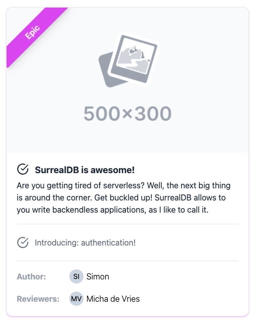

# A ticket system demoing NextJS + SurrealDB

This app showcases how you can use nextjs in combination with surrealdb.



[Live demo](https://tickets.smartnuance.com) | [SurrealDB RPC](https://surrealdb.smartnuance.com/rpc)

## How to use?

- Install SurrealDB on your system.
- Run SurrealDB:
  ```
  surreal start --user=root --pass=root --log=debug memory
  ```
- Run `pnpm i` in the root of the project to install dependencies.
- Run nextjs app:
  ```
  export NEXT_PUBLIC_SURREAL_ENDPOINT=http://localhost:3000/rpc
  ```
  Run `pnpm dev`  to start the NextJS development server.
- Access the app at: http://localhost:8000
- Import data
    ```sh
    surreal import -c http://localhost:8000 -u root -p root --ns default --db default tables/user.surql
    surreal import -c http://localhost:8000 -u root -p root --ns default --db default tables/ticket.surql
    ```

## Deploy

Since the deployment secrets are encrypted with [git-crypt](https://github.com/AGWA/git-crypt), you have to either

- get added as a collaborator and receive access this repository's secrets or
- fork your own copy and create your custom secret file `secrets/surrealdb.env` with the following environment variables:
    ```
    USER=root
    PASS=<your password>
    ```

Build push image tagged as `latest`:
```sh
docker build -t ghcr.io/smartnuance/tickets:latest .
export CR_PAT=XXX
echo $CR_PAT | docker login ghcr.io -u USERNAME --password-stdin
docker push ghcr.io/smartnuance/tickets:latest
```

Deploy to a kubernetes cluster:
```
kubectl apply -k k8s/prod
```

## Attribution

Based on https://github.com/kearfy/demo-nextjs-surrealdb.
